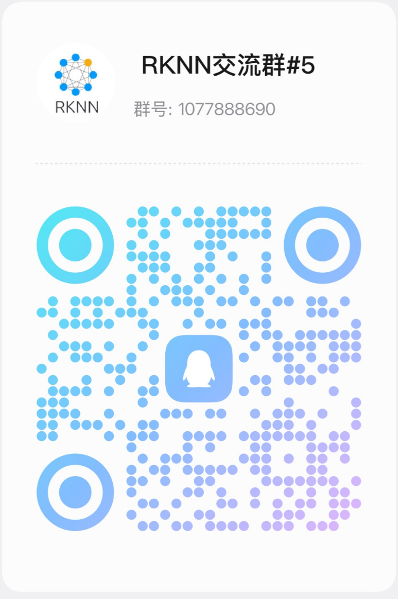

[中文](README_CN.md)

# Introduction

RKNN3 SDK provides the complete software stack for deploying AI models on RK1820/RK1828 coprocessors, including:

- **[RKNN3-Toolkit](https://github.com/airockchip/rknn3-toolkit)**: PC-side software development kit for model conversion, inference, performance evaluation, etc.
- **RKNN3 Runtime**: On-board runtime library providing C/C++ programming interfaces for deploying RKNN models and accelerating AI applications.
- **[RKNN3 Model Zoo](https://github.com/airockchip/rknn3-model-zoo)**: Model conversion and deployment example repository, including reference implementations for CNN / LLM / VLM and other models.

**Typical Workflow**: Users first convert their trained models to RKNN format using RKNN3-Toolkit on a PC, then perform inference on the development board via the RKNN3 Runtime API.

# Supported Platforms

- RK1820
- RK1828

**Note**:

- **For RK3588/RK3576/RK3568/RK3566/RK3562 series, RV1103/RV1106, RV1103B/RV1106B, RV1126B, RK2118, please refer to:**

  https://github.com/airockchip/rknn-toolkit2

- **For RK1808/RV1109/RV1126/RK3399Pro, please refer to:**

  https://github.com/airockchip/rknn-toolkit

  https://github.com/airockchip/rknpu

  https://github.com/airockchip/RK3399Pro_npu

- **RKNN3 Model Zoo provides more conversion and deployment examples**

  https://github.com/airockchip/rknn3-model-zoo

# Supported Models

 - [x] Qwen2.5-0.5B / 1.5B / 3B / 7B
 - [x] Qwen3-0.6B / 1.7B / 4B / 8B
 - [x] HY-MT1.5-1.8B
 - [x] Youtu-LLM-2B
 - [x] Qwen2.5-VL-3B / 7B
 - [x] Qwen2.5-Omni-3B (Thinker)
 - [x] Qwen3-VL-2B / 4B
 - [x] FastVLM-1.6B
 - [x] InternVL3-2B
 - [x] InternVL3.5-4B
 - [x] MiMo-VL-7B-RL
 - [x] Qwen3-Reranker-0.6B / 4B
 - [x] Qwen3-Embedding-4B
 - [x] GLM-Edge
 - [x] SmolVLM
 - [x] UI_TARS
 - [x] gme-Qwen2-VL-2B
 - [x] SigLIP
 - [x] SigLIP2
 - [x] DINOv2
 - [x] DINOv3
 - [x] MobileNetV1 / V2
 - [x] ResNet-50
 - [x] YOLOv5 / YOLOv6 / YOLOv8
 - [x] YOLO-World
 - [x] Diffusion Policy
 - [x] Whisper
 - [x] SenseVoice

# Performance

For performance data, please refer to the [Release Notes](doc/00_Rockchip_RK182X_ReleaseNote_RKNN3_SDK_V1.0.0_EN.pdf).

# Notes

- **RKNN3-Toolkit** is **not compatible** with [RKNN-Toolkit](https://github.com/airockchip/rknn-toolkit) and [RKNN-Toolkit2](https://github.com/airockchip/rknn-toolkit2).

# Supported Python Versions:

- Python 3.10
- Python 3.12

# Latest Version: V1.0.0

# Changelog

## V1.0.0
- Significantly improved LLM/ViT performance; overall LLM decode performance improved by more than 15%.
- Expanded model support range, adding models such as Qwen3-VL / Qwen2.5-Omni(Thinker) / GLM Edge / SmolVLM.
- Added support for cross-board accuracy analysis.
- Added support for overlapping data transfer and inference.
- Added support for mRoPE.
- Added support for Function Call.
- Added support for YUV-format input.
- `rkllm3-server` now supports embedding models and audio input.
- Added support for concurrent multi-core, multi-model inference.
- Added support for custom model post-processing on the coprocessor.
- Optimized implementation of exSDPA, exMatMul, Resize, Transpose operators.
- Provides RKNN3 Toolkit Lite package to support Python API calls on development boards.

# Feedback and Community Support

- [Redmine](https://redmine.rock-chips.com) (**Recommended for reporting issues. Please contact sales or an FAE to get a Redmine account**)
- QQ Group 1: 1025468710 (Full, please join group 5)
- QQ Group 2: 547021958 (Full, please join group 5)
- QQ Group 3: 469385426 (Full, please join group 5)
- QQ Group 4: 958083853 (Full, please join group 5)
- QQ Group 5: 1077888690

  
  
  
  
  

