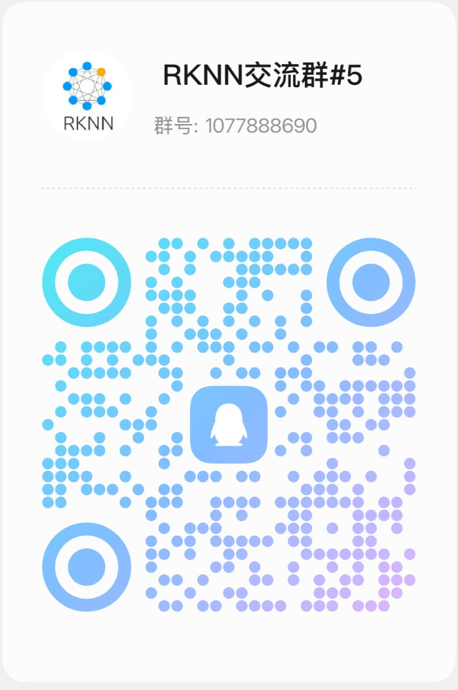

[中文](README_CN.md)

# Introduction

RKNN3 SDK provides the complete software stack for deploying AI models on RK1820/RK1828/RK3572, including:

- **[RKNN3-Toolkit](https://github.com/airockchip/rknn3-toolkit)**: PC-side software development kit for model conversion, inference, performance evaluation, etc.
- **RKNN3 Runtime**: On-board runtime library providing C/C++ programming interfaces for deploying RKNN models and accelerating AI applications.
- **[RKNN3 Model Zoo](https://github.com/airockchip/rknn3-model-zoo)**: Model conversion and deployment example repository, including reference implementations for CNN / LLM / VLM and other models.

**Typical Workflow**: Users first convert their trained models to RKNN format using RKNN3-Toolkit on a PC, then perform inference on the development board via the RKNN3 Runtime API.

# Supported Platforms

- RK1820
- RK1828
- RK3572

**Note**:

- **For RK3588/RK3576/RK3568/RK3566/RK3562 series, RV1103/RV1106, RV1103B/RV1106B, RV1126B, RK2118, please refer to:**

  https://github.com/airockchip/rknn-toolkit2

- **For RK1808/RV1109/RV1126/RK3399Pro, please refer to:**

  https://github.com/airockchip/rknn-toolkit

  https://github.com/airockchip/rknpu

  https://github.com/airockchip/RK3399Pro_npu

- **RKNN3 Model Zoo provides more conversion and deployment examples**

  https://github.com/airockchip/rknn3-model-zoo

# Supported Models

### LLM

 - [x] Qwen2.5
 - [x] Qwen3
 - [x] Qwen3.5
 - [x] Youtu-LLM
 - [x] GLM-Edge
 - [x] MiniCPM5
 - [x] Nanbeige4.2
 - [x] FunctionGemma
 - [x] LFM2.5

### VLM

 - [x] Qwen2.5-VL
 - [x] Qwen3-VL
 - [x] Qwen3.5-VL
 - [x] FastVLM
 - [x] InternVL3
 - [x] InternVL3.5
 - [x] MiMo-VL-RL
 - [x] Janus-Pro
 - [x] MiniCPM-V-4
 - [x] SmolVLM
 - [x] SmolVLM2
 - [x] UI_TARS
 - [x] gme-Qwen2-VL
 - [x] LocateAnything

### Omni

 - [x] Qwen2.5-Omni (Thinker)
 - [x] Qwen3-Omni
 - [x] Qwen3.5-Omni
 - [x] Gemma4

### ASR (Speech Recognition)

 - [x] Qwen3-ASR
 - [x] WeNet (Conformer)
 - [x] Whisper
 - [x] SenseVoice
 - [x] Zipformer

### TTS (Text-to-Speech)

 - [x] Qwen3_TTS
 - [x] VITS

### Embedding / Reranker

 - [x] Qwen3-Embedding
 - [x] Qwen3-Reranker

### Translation

 - [x] HY-MT1.5

### OCR

 - [x] PaddleOCR VL

### CV (Computer Vision)

 - [x] SigLIP
 - [x] SigLIP2
 - [x] MetaCLIP2
 - [x] QA-CLIP
 - [x] DINOv2
 - [x] DINOv3
 - [x] Depth-Anything-V2-small
 - [x] Depth-Anything-V3
 - [x] Diffusion Policy
 - [x] GR00T
 - [x] MiniCPM-RobotManip
 - [x] MobileNetV1 / V2
 - [x] ResNet-50
 - [x] YOLOv5 / YOLOv6 / YOLOv8
 - [x] YOLO-World
 - [x] YOLO26 / YOLO26-Segment / YOLO26-Pose

### Pre-converted RKNN Models

Users can download pre-converted RKNN models from the [RKNN3_SDK cloud drive](https://console.box.lenovo.com/l/H1fig1) (access code: `rknn`). The models for this release are available under `RKNN3_SDK/rknn3_models/v1.1.0`.

# Performance

For performance data, please refer to the [Release Notes](doc/EN/00_RKNN3_SDK_Release_Notes_V1.1.0.pdf).

# Notes

- **RKNN3-Toolkit** is **not compatible** with [RKNN-Toolkit](https://github.com/airockchip/rknn-toolkit) and [RKNN-Toolkit2](https://github.com/airockchip/rknn-toolkit2).

# Supported Python Versions:

- Python 3.10
- Python 3.12

# Latest Version: V1.1.0

# Changelog

## V1.1.0
- Added RK182X multi-card cascade support
- Added Qwen3.5 model support
- Added Qwen3.5 and Gemma4 Prefix Caching support
- Added custom CPU operator support
- Added support for different context lengths across sessions
- Added Tie Word Embedding support
- Added RKNN3 Toolkit support for macOS (Beta)
- Optimized host-side memory usage during KVCache import and export
- Optimized `rknn3_mem_sync` API performance
- Optimized GPU memory usage during GRQ quantization
- Updated the usage of external GRQ quantization
- Changed the RKNN3 Toolkit model import method to use ONNX only (TensorFlow/TFLite/Caffe/DarkNet support removed)

For more information about previous releases, please refer to [CHANGELOG.md](CHANGELOG.md).

# Feedback and Community Support

- [Redmine](https://redmine.rock-chips.com) (**Recommended for reporting issues. Please contact sales or an FAE to get a Redmine account**)
- QQ Group 1: 1025468710 (Full, please join group 5)
- QQ Group 2: 547021958 (Full, please join group 5)
- QQ Group 3: 469385426 (Full, please join group 5)
- QQ Group 4: 958083853 (Full, please join group 5)
- QQ Group 5: 1077888690

  
  
  
  
  

